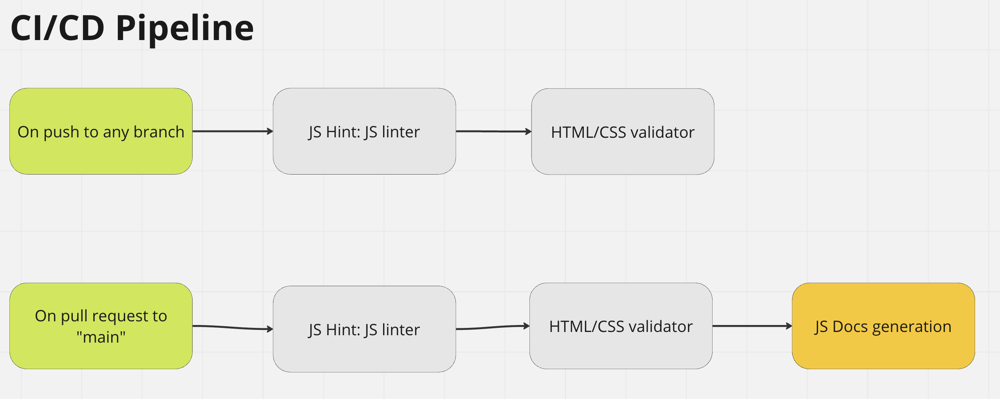

# CI/CD Pipeline Phase 1
[Current Actions](#currently-implemented) | [Future Actions](#future-additions)

## Currently Implemented

### JS Hint
- Used to check code quality
- Notes:
  - In the [yml](../../.github/workflows/ci-cd-piepline.yml), there is a config file that is written by `echo` (lines 13-17) that specify two options:
    - `esversion = 7`: this says that our JS code is written to follow [ECMAScript 7](https://en.wikipedia.org/wiki/ECMAScript#:~:text=ECMAScript%20(%2F%CB%88%C9%9Bkm,prototype%2Dbased%2C%20functional%2C%20imperative)). ECMAScript is a JavaScript standard to ensure the interoperability of web pages across different web browsers.
    - `"loopfunc": true`: this surpresses the error of using global variables like `window`
    - The `grep` line ensures JSHint excludes the JS files in ./8-ball/

### JS Docs
- Used to generated documentation per the JSDocs schema
- Used [this](https://github.com/marketplace/actions/jsdoc-action) GitHub Action by GitHub users *andstor* and *waldyrious*
- Notes:
  - As of 5/21/23, documentation is not outputting, this may be due to JS files not following JSDocs convention

### HTML/CSS Validation
- Used to check HTML/CSS and ensure we pass validation
- Used [this](https://github.com/marketplace/actions/html5-validator) GitHub Action by GitHub users *Cyb3r-Jak3*, *ptmkenny*, *khusika*, and *JakeVdub*
- Notes:
  - CSS validation is true, error logs are currently only printed in the GitHub action
    - We can specify where to publish logs to later

## Future Additions
- Unit Tests
- Deploy to a "test server" on any push to branch