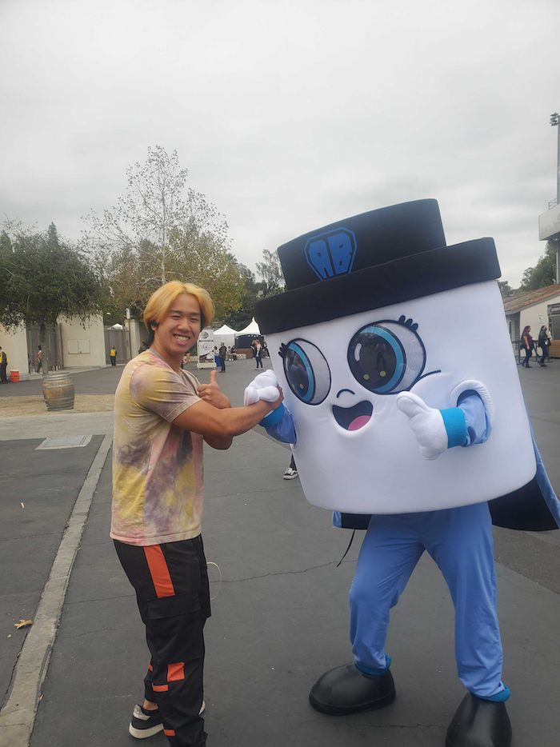

# Team 4: Powell Rangers
Welcome to the **Powell Rangers**. We are a squad of aspiring software engineers that
are dedicated to improving communities around us through the code we create. 

## Values:
- We believe that being on a team means collaborating with others and being able
  to work towards a common goal.
- We believe that members should be comfortable reaching out for help.
- We believe that accountability is crucial when working in a team environment.
- We believe that conflict resolution should be approached with respect,
  communication, and a willingness to compromise.

  

# Squad Members

## Team Leaders:

  
[Brandon Imai](https://bimai25.github.io/cse110-lab1/)  
My name is Brandon Imai and I am a second-year computer science major at ERC. I enjoy sports and am a big fan of the Los Angeles Angels, Anaheim Ducks, and Los Angeles Clippers. I also enjoy auto racing and watch Formula 1, Formula E, and Indycar. I am a big fan of Star Wars and try as much as I can to live by Yoda’s wisdom:
>Do or do not, there is not try.

Outside of school I am active in Eta Kappa Nu (HKN) and play for the UCSD Club Baseball Team where I serve as the Treasurer. I also recently got really into bowling.  

[Nakul Nandhakumar](https://nakulnandhakumar.github.io/NakulLabWeek1/)  
Hi! My name is Nakul Nandhakumar. I’m 20 years old and am currently a Sophomore. I’m majoring in Computer Engineering and planning to minor in Physics. I’m very interested in fields such as Device Physics and Quantum Computing and plan to attend graduate school in the future. I really enjoy PBL courses and have always enjoyed coding in a team, especially when the project relates to real life issues. I am looking forward to the rest of CSE 110. 

## Developers:

  
[Abijit Jayachandran](https://abijitj.github.io/CSE110-Lab1/)  
Hello! I’m a second-year CE student who is interesting in learning more about the software engineering process. Additionally, I am curious how AI will be a part of this class as it was hinted at in the syllabus and by the professor during lecture.  

  
[Christian Lee](https://outisnomore.github.io/CSE110-User-Page/)  
I am a student at UCSD currently studying Computer Science. Some of the langauges I have worked with include:
- Java
- C/C++
- Python
- Kotlin 

Some of the cool things that I’ve done over the past years include some small personal projects, like this very basic image processing toolkit, and helping graduate students by being their minion research assistant. All jokes aside, research was a very rewarding and interesting insight into what sort of career options and paths are available as a developer. Having had some exposure on what it is like doing research, I hope to continue gaining experience through internships to see what it is like working in industry. In fact, my 1st priority at the moment is trying to find some opportunity to keep myself occupied with during the Summer.  

  
[Ezgi Bayraktaroglu](https://ebayraktaroglu.github.io/CSE110/)  
Hi, I'm Ezgi Bayraktaroglu. I'm 19 years old. My pronouns are she/her/hers. I was born in San Diego. My parents are from Türkiye and I'm a second year computer science major at UCSD in Earl Warren College. I’ve been programming for around 5 years. I first took AP Computer Science Principles in my sophomore year of high school, and I enjoyed it. I then joined an organization called the League of Amazing Programmers and learned Java. I am majoring in computer science at UCSD. I know Java, some Python, and some C and C++.  

  
[Helen Lin](https://miyuki-l.github.io/Github-User-Page/)  
Hello! I am Helen Lin. I am a student at UCSD studying Mathematics-Computer Science. I am from Irvine, California and also South Africa. In my free time, I like to cook and bake and do ocasional arts and crafts.  

  
[Joshua Tan](https://josh-tan-20-09-13.github.io/cse-110-github-pages/)  
Hi everybody, I am Joshua Tan and this is my user page for the class CSE 110 at the University of California, San Diego.
One of my favorite computer science related books is The C Programming Language by Brian Kernighan and Dennis Ritchie.
I like to work on anything technology related and have recently taken a deep dive into computer hardware and overclocking.
I enjoy good food, socializing, video games, and sleeping.  

  
[Khanh Le](https://pandawarlord.github.io/CSE-110-lab-1/)  
I am vietnamese. I know more korean than vietnamese. I can hit the gwiddy. I like anime. 
I do enjoy cosplaying. I love trains.  

  
[Michi Wada]()  
So, 3 things about me is that I am a CS major. I am a black belt in karate (well I don't practice anymore, but it's interesting I guess), and that I have multiple boxes of frosted flakes in my room (I didn't open any of them)  

  
[Samuel Au](https://samuelau824.github.io/CSE-110-Lab-1/)  
I am currently a third-year at UC San Diego studying Math-Computer Science. Some of my hobbies include listening to music, playing video games with friends, and going on late night drives to release stress. My goals for this course include learning what it means to work with others effectively as a software engineer.  
