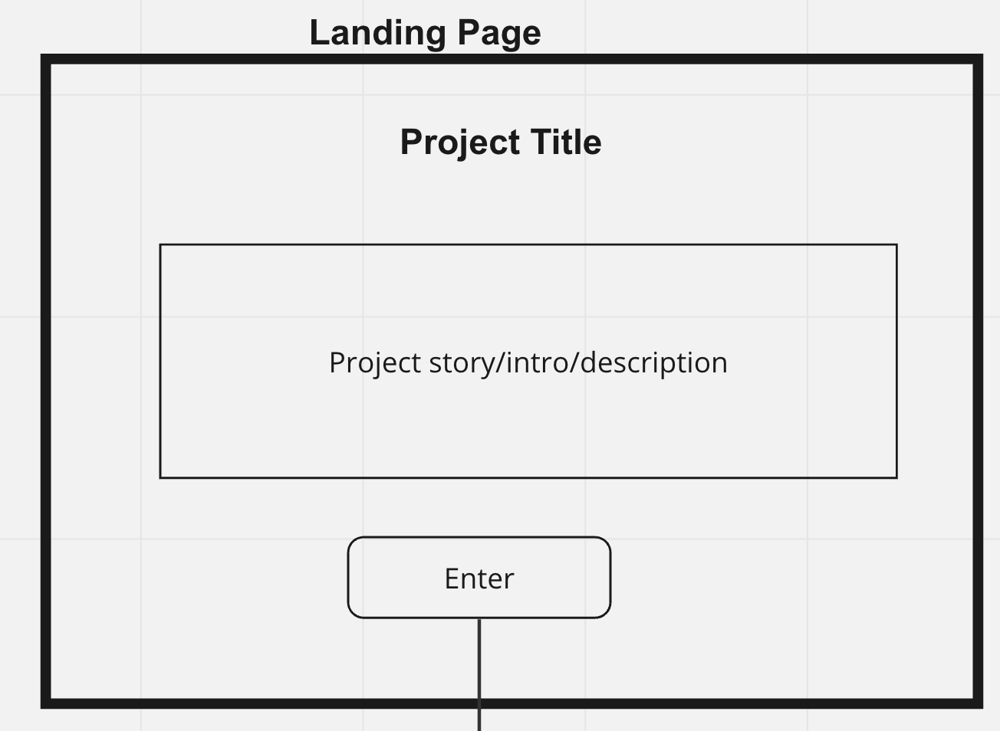
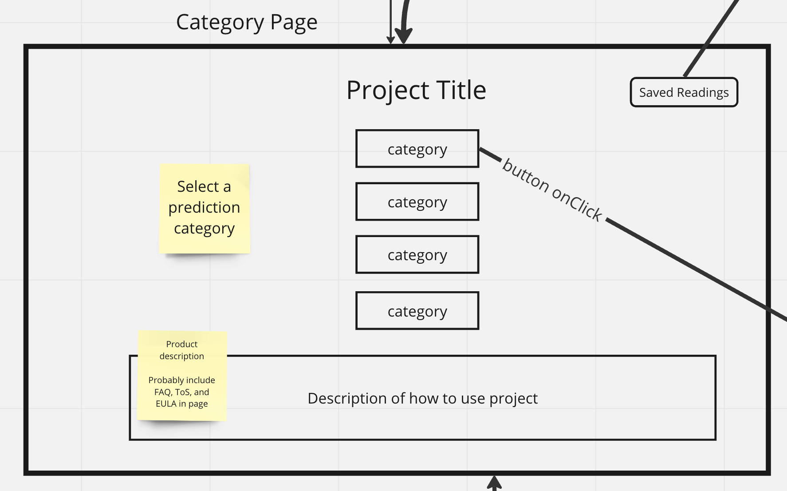
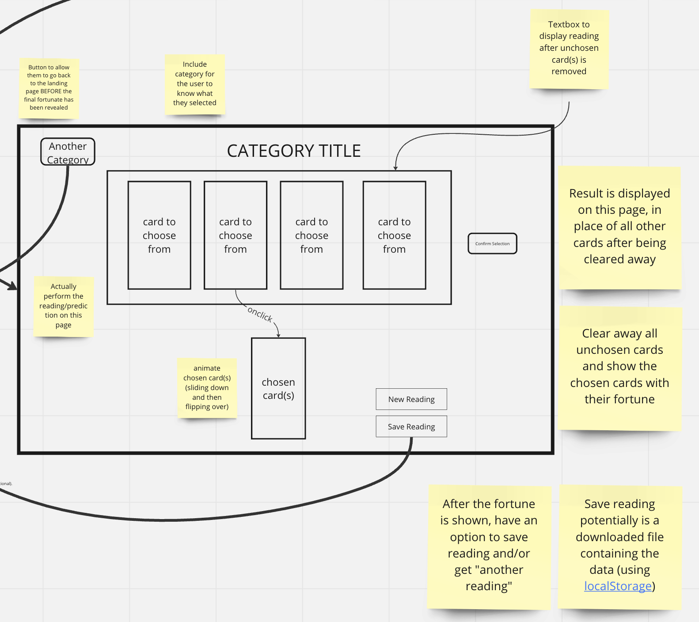
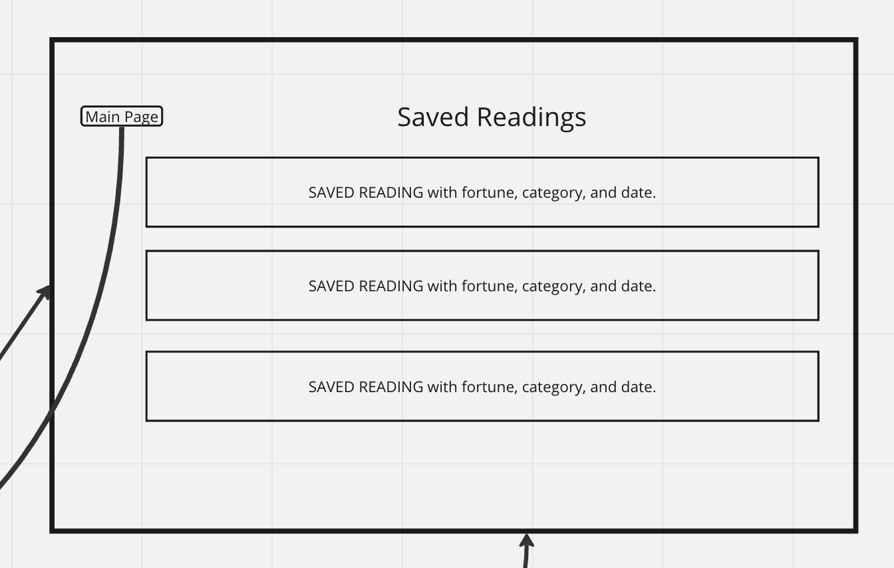
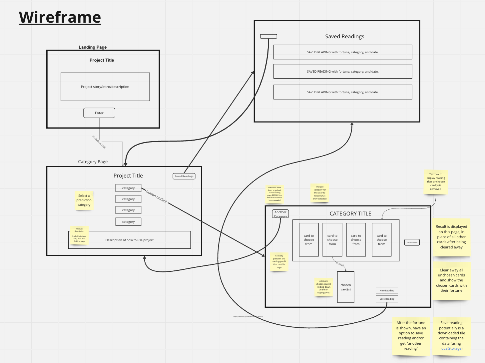
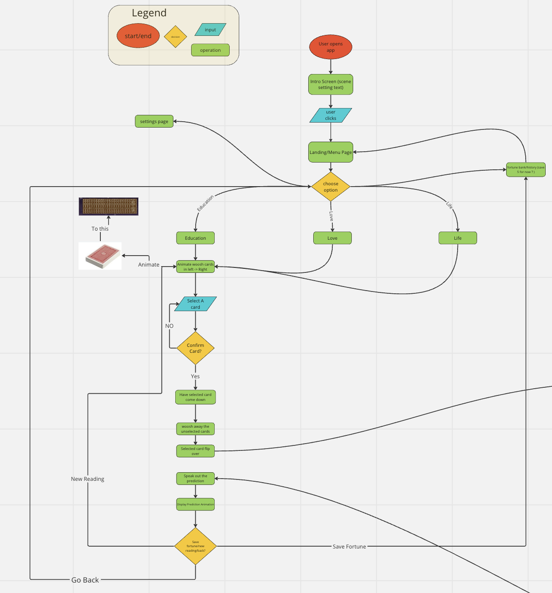
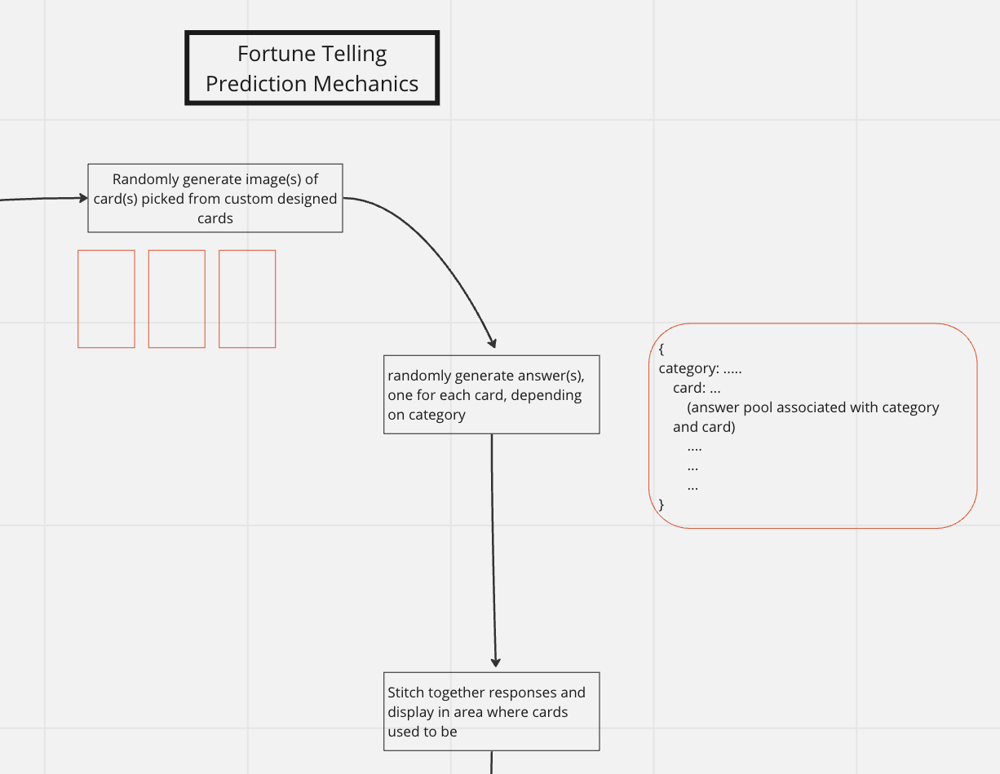

# Powell Rangers Fortune Telling Final Project Pitch

<!---From Shape Up, need to include Problem, Appetite, Solution, Rabbit holes, and no gos in the project pitch -->
[Statement of Purpose](#statement-of-purpose---the-problem) | [Appetite](#appetite---time-scope-of-app) | [Our App](#solution---our-app) | [Risks/Rabbit Holes](#risksrabbit-holes) | [No Gos](#no-gos) | [Diagrams](#diagrams) | [Links](#links)

## Statement of Purpose - The Problem
If you were to search on the app store "Fortune Telling Apps", hundreds of apps will come up. If you were to google "Fortune Telling Websites", the same result will occur. With Wikipedia stating there are multitudes of different methods of fortune telling per culture and the many already existing fortune telling programs that exist, the market is certainly saturated.

Yet, society still fears uncertainty and seek for something to give them some kind of confidence for the future. According to the Pew Research Center, 15% of Americans sought psychic services in 2022. In a 10 year period from 2011 - 2022, the market value of psychic services increased from 1.9 million dollars to 2.2 million dollars.

It is evident that there is still a want for psychic services. In our initial research, we found a need for a more streamlined way of receiving a fortune, making the fortune telling process more efficient with just enough user input while heightening the gravitas through mystical animations. Existing apps tend to have subpar UIs and incoherent responses that don't answer the user's inputted questions. Our app aims to resolve these two issues.

## Appetite - Time Scope of App
With the constraints of CSE 110, we only have 4 full weeks to complete the app. This greatly limits the amount of features we want to implement as we are restricted by time. This is why we want to focus on the UI and design, and we are not going to allow users to input their own questions. While we could try to develop a model to analyze questions and return coherent answers, this is not possible within a 4 week time scope. We will detail an [MVP](#mvp-features) below that our aim is to be completed by the end of Week 8. For the remaining two weeks, we will either work on getting our product to the MVP, polishing the MVP, or adding extra features depending on the status of the app at the end of Week 8.

## Solution - Our App
Considering the problem and the appetite, our app will be a card-based fortune telling app that will give a fortune based off of three categories: *education*, *love*, and *life*. Upon opening our app ([app diagram](#diagrams)), users will be able to choose between the 3 categories to choose what kind of fortune they will receive. Then, 6 cards will appear and the user will be prompted to pick a card. They will be asked to confirm the card and if they do their fortune is revealed. The fortune can then be saved in a "fortune bank" and the user is asked if they would like to start a new fortune.

## MVP Features
- Landing screen with an app intro story (lore)

- User can select a fortune from 3 categories: education, life, or love

- Users can select their fortune from an array of cards

- During the fortune picking process, the cards will slide out from a full deck of cards. Selected cards will rise up and be highlighted in purple. If the card is confirmed, the remaining cards will be animated to recollect themselves in a deck while the chosen card will spin while mystical sparkles fly in the background. The screen darkens and the fortune is displayed.
- Users can save their fortunes in a "fortune bank"

## Risks/Rabbit Holes
### Risks
- User may not like having only 3 choices of fortune
- We do not generate enough fortunes and users get the same fortune due to RNG
- Animations become more difficult than originally anticipated
- App is not visually aesthetic, missing a key spec of the MVP

### Rabbit Holes
- Choice of animation
  - Animations will be clearly drawn out and mocked up before coding so that there is clarity in what is expected. Adaptations/creative adjustments are to be expected, but everyone will understand the baseline animation aspects before beginning.
- Fortune choices
  - The three choices of fortunes (education, life, and love) were formally agreed upon by the team and these three will be the original core categories
  <!--- Should we make an ADR for this? --->

## No Gos
- Open ended questions are a no go. This is because it is too difficult to try and build a model that can answer any type of questions. Limiting the scope of questions into striclty categories will make the interaction of our app better and easier for us to manage.
- Image-based fortune telling. Building some kind of model (whether it be "AI" or "pseudo image generation") was not feasible to accomplish in the alotted time frame. By going with cards, the MVP is easier to complete and has the possibility to incorporate other aspects of fortune telling as specificed by our iniitial research.

## Diagrams
[Miro Board](https://miro.com/app/board/uXjVMOc-kq0=/?) which has all our wireframes and flowcharts. Screenshots will be provided below, however, it's probably easier to interact with on the Miro Board.

**Full Wireframe**

**App Flowchart**

**Fortune Telling Backend**

## Possible Future Features
- More fortune categories
- Allow users to pick more than one card, or answer more in-between questions to make it feel as if they have more control/input over the outcome of their fortune.
- Sharing the fortune on social media or even emailing it to themselves

## Links
[User Stories](https://github.com/cse110-sp23-group4/cse110-sp23-group4/tree/main/specs/users) | [ADRs](https://github.com/cse110-sp23-group4/cse110-sp23-group4/tree/main/specs/adrs) | [Miro Board](https://miro.com/app/board/uXjVMOc-kq0=/?share_link_id=581975284588)