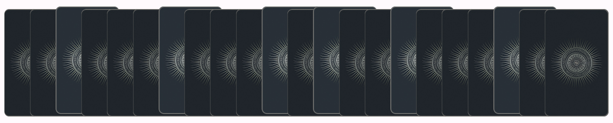

# Persona - Jaden the Amused Cynicist 

## Introduction

Hello! My name is Jaden, I think that fortune-telling is a **bunch of baloney**. However, I often find it funny and engaging how various fortune-tellers go about their craft. For example, many of the reading ceremonies are often engaging and **fun to watch**. It might interesting to personally have such an experience. 

## User Story

As a person who simply wants to have fun with fortune-telling, I want to be **immersed in the experience**, so that it is as enjoyable as possible. 

## Relevant Features

This person, clearly does not take fortune telling seriously. However, they find the experience and atmosphere around it fascinating. As such, they might particularly value having a **lot of ceremony** before receiving their answer. 

We have not decided specifically what kind of card fortune-telling we will be settling on. As such, here are some features we could choose from depending on what kind of app we choose to do. 

1. Being able to directly interact with the cards in some way, shape or form. This could involve being able to drag the cards, shaking their device to shuffle the cards, or other similar effects. 
   
2. Have the cards start shuffling slowly and then speed up over time (along with music that increases in tempo) before dramatically revealing the "answer" / card. 
   
3. When the user selects a card, have a short animation that clearly shows that the card has been picked. For example, on [this site](https://www.free-tarot-reading.net/free), the cards pop up when they are selected (shown below). It is simple but very effective. Another [website](https://www.evatarot.net/) plays a cool animation to draw a card and reveal it to the user.
   

4. Another way to increase the ceremony could be to have multiple stages in the process. For example, in this [site](https://www.evatarot.net/interpretation.php), they first ask you to think about your question, then your strengths as a person, and then also weaknesses before giving you the answer (but not before asking you to create an account :0 ). This will allow us to have a greater amount of variety in our animations and UI, making the experience more engaging. 

**In conclusion**, the general idea for this persona, is to make the experience as unique and enjoyable as possible. One way to do this is to increase the ceremony. 

**Extra thought**, for such a person, it might be important to make the experience as variable as possible so that they do not get bored of the experience. This point might already be covered by the 4th feature above. However, I feel there might be some other ways (perhaps using AI?), but I am not sure how exactly. Just a thought to put out there. 