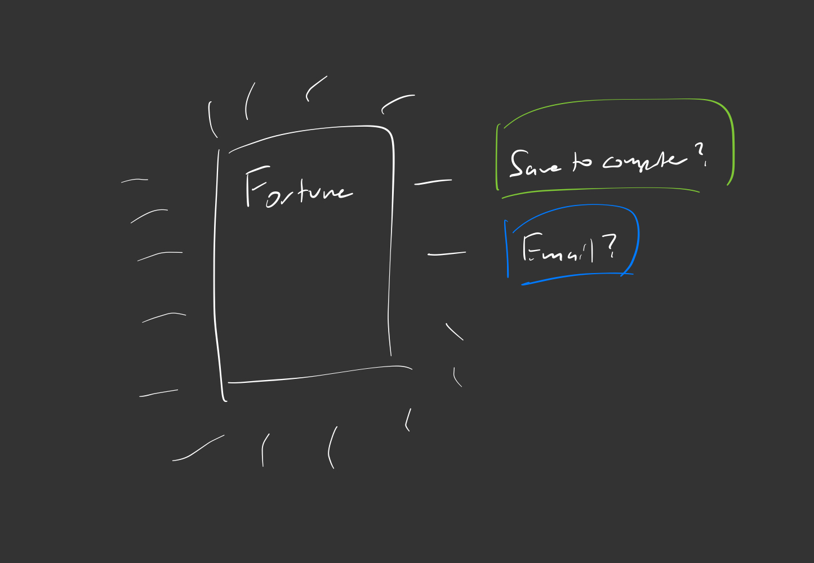
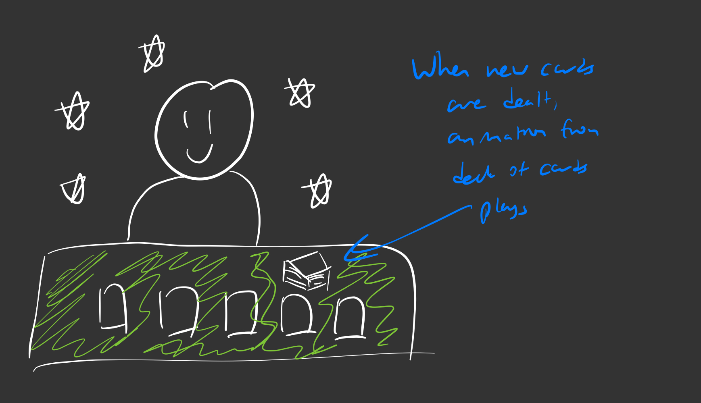

# Personas
We want to know what kind of people could be using our apps. I will come up with a couple personas of people who could benefit from our app. Overall, we want our app to be one used in a fun aspect. It is one of those things that society falls back onto for some sense of security, but overall it is a gimmick. It's impact on society is very similar to those name relationship compatibility apps.
- Riley
  - 13 year old middle schooler
  - Likes Taylor Swift and Katy Perry
  - Has typical teenage anxiety and has a crush on another person in her class
  - Is very active on TikTok and has a decent following
    - She is in the beginning of starting her own YouTube channel
- Mark
  - 20 year old business major who attends Ohio State University
  - Is very into day trading, drinks 5 red bulls a day
  - Aspires to be a venture capitalist
  - Very active in his school's finance club and frats

Riley uses our app as the topic of her upcoming TikTok. She wants to ask the app her chance at getting with the person she is currently crushing on. She wants the app to have a very "magical, showy, and elaborate" decision process to build hype and produce *content*. She would like to be able to store her past fortunes so she can go back and look at what the stars had aligned for her. She also would like to share her results on any social media site. Riley likes how our app is quick, repeatadble, and able to do multiple times with the same amount of wonder.

Mark uses our app to boost his self-esteem. His day trading has not been going well, he is constantly tired, and his grades are slipping. He wants something (anything really) to show him that everything will be okay and work out in the end. He turns to the fortuen telling app and asks it what is in store for him. The app asks him how he has been feeling the past couple of days, what he has eaten, and what his dreams are. The fortune teller then shows him a card with his fortune. Mark is happy with the result and saves the result to his phone (via email or photo).
# User Story
1. As a user, I want to have choices in the process of receiving my fortune so that it is personalized to my situation.
2. As a user, I want to have a way to retry my luck at the same fortune so that I can feel better about the results.
3. As a user, I can choose my theme so that it is customizable to me and affects the outcome of my fortune.
4. As a user, I want to access past fortune so that I can share them with my friends.

# Features
1. As mentioned in the personas, I think we should include some way to save/share results. While sharing to social media is definitely a stretch, I think an easy one that could be possible is either saving an image to local storage or emailing the results to themselves.

2. An ability to store your card in your history, including dividing them into good and bad fortunes
3. I think a lot of the draw from our app will come from the UI. Like the 8-ball, if we push ourselves to create a cool interactive UI, then the UI itself becomes a feature.
4. Mock splash screen I drew

